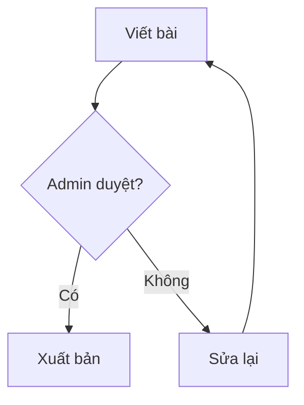

# Hướng dẫn Markdown toàn diện trên Louis Space

Trang này hướng dẫn **toàn bộ** tính năng Markdown mà Louis Space hỗ trợ — mỗi phần đều có ví dụ **render thật** ngay bên cạnh cú pháp gốc (trang này chính nó được viết bằng Markdown và render bằng đúng engine mà bạn dùng để viết tin tức, mô tả game, hồ sơ và bio).

Dùng ô **"Thử ngay"** ở đầu trang để gõ Markdown và xem kết quả trực tiếp — tất cả tính năng dưới đây đều thử được ở đó.

## Mục lục

[toc]

## 1. Định dạng chữ cơ bản

| Cú pháp | Kết quả |
|---|---|
| `**in đậm**` | **in đậm** |
| `*in nghiêng*` | *in nghiêng* |
| `***đậm + nghiêng***` | ***đậm + nghiêng*** |
| `~~gạch ngang~~` | ~~gạch ngang~~ |
| `++chèn thêm++` | ++chèn thêm++ (hiện như chữ thêm mới) |
| `==đánh dấu==` | ==đánh dấu== (nền vàng) |
| `__gạch dưới__` | __gạch dưới__ |
| `` `code inline` `` | `code inline` |
| `H~2~O` | H~2~O (chỉ số dưới) |
| `x^2^` | x^2^ (lũy thừa/chỉ số trên) |
| `[[Ctrl]]` | phím bàn phím — viết [[Ctrl]] + [[C]] để copy |

## 2. Tiêu đề & neo link

Dùng `#` đến `######` cho 6 cấp tiêu đề. Mỗi tiêu đề có **mô tả neo** (con trỏ chuột hiện dấu `#`, bấm để sao chép link đến đúng mục đó).

Bạn có thể **tự đặt id** cho tiêu đề bằng cú pháp `{#id-rieng}`:

```md
## Cài đặt nhanh {#cai-dat-nhanh}
```

Link nội bộ chỉ cần `[#cai-dat-nhanh](#cai-dat-nhanh)` — xem thử: [tới mục Cài đặt nhanh](#cai-dat-nhanh).

## 3. Danh sách

- Danh sách không thứ tự
- Lồng nhau:
  - Mục con
  - Mục con khác
- Quay lại mức ngoài

1. Danh sách có thứ tự
2. Tự động đánh số

### Công việc (task list)

- [x] Học cú pháp cơ bản
- [x] Học bảng
- [ ] Viết bài đầu tiên
- [ ] Đăng game lên Louis Space

## 4. Bảng (tự sắp xếp được)

Mọi bảng trong bài viết đều **bấm vào tiêu đề cột để sắp xếp** (hỗ trợ số kiểu Việt Nam, ngày tháng và chuỗi tiếng Việt):

| Game | Lượt chơi | Đánh giá |
|---|---:|---:|
| Rust Adventure | 12.500 | 4,8 |
| Neon Racer | 9.800 | 4,5 |
| Pixelden | 8.000 | 4,9 |

Canh lề bằng dấu `:` trong dòng phân tách: `|---:|` là cột phải, `|:---:|` là giữa.

## 5. Code block — highlight + số dòng + copy

Bọc code bằng ba dấu backtick kèm tên ngôn ngữ. Engine tự **tô màu cú pháp** (hơn 200 ngôn ngữ), **đánh số dòng**, gắn nhãn ngôn ngữ và **nút copy**:

```rust
fn main() {
    let msg = "Xin chào Louis Space!";
    println!("{msg}");
}
```

### Diff / patch

Dùng ` ```diff ` để tô màu dòng thêm/bớt như git diff:

```diff
- let score = 0;
+ let score = 100;
@@ config @@
```

## 6. Trích dẫn & Callout

> Trích dẫn thường — lùi lề với dấu `>`

Callout dùng cú pháp GitHub `[!LOẠI]` ngay đầu blockquote:

> [!NOTE]
> Ghi chú — thông tin bổ sung, màu xanh dương.

> [!TIP]
> Mẹo — cách làm nhanh hơn, màu xanh lá.

> [!WARNING]
> Cảnh báo — dễ gây lỗi, màu cam.

> [!CAUTION]
> Nguy hiểm — có thể mất dữ liệu, màu đỏ.

> [!IMPORTANT]+
> Callout **mở rộng được** — thêm dấu `+` để mặc định mở, `-` để mặc định thu gọn.

## 7. Ẩn nội dung (spoiler)

Dùng `||nội dung||` để làm spoiler — nền đen, rê chuột hoặc bấm mới hiện:

Kết quả trận chung kết: ||Louis Space thắng 3-1||

## 8. Link & đa phương tiện

- `[Chữ hiển thị](https://github.com/mhieuhonda/khogame)` — [Chữ hiển thị](https://github.com/mhieuhonda/khogame)
- Link tới người dùng: gõ `@mhieuhonda` — @mhieuhonda
- Tag chủ đề: gõ `#game-moi` — #game-moi

### Ảnh

```md


```

Ảnh có tiền tố `caption:` trong phần mô tả sẽ hiện **chú thích bên dưới**. Mọi ảnh tự động **lazy-load** (chỉ tải khi cuộn tới) và tối ưu `async`.

### Nhúng YouTube & Vimeo

Chỉ cần **dán link video đơn độc một dòng** — engine tự chuyển thành trình phát nhúng:

```md
https://www.youtube.com/watch?v=dQw4w9WgXcQ
https://vimeo.com/76979871
```

### Nhúng file video / audio trực tiếp

Dán link kết thúc bằng `.mp4`, `.webm`, `.ogv`, `.mov`, `.m4v` → trình phát video; `.mp3`, `.wav`, `.m4a`, `.aac`, `.flac` → trình phát audio:

```md
https://example.com/video/trailer.mp4
https://example.com/audio/nhacnen.mp3
```

## 9. Công thức toán (KaTeX)

Dùng `$...$` cho công thức trong dòng và `$$...$$` cho công thức riêng dòng:

```md
Công lượng: $E = mc^2$

$$\int_0^\infty e^{-x^2}\,dx = \frac{\sqrt{\pi}}{2}$$
```

Kết quả render:

Công thức nổi tiếng: $E = mc^2$

$$\sum_{k=1}^{n} k^2 = \frac{n(n+1)(2n+1)}{6}$$

## 10. Sơ đồ Mermaid

Vẽ **lưu đồ, sơ đồ lớp, timeline, gantt, mindmap** bằng block ` ```mermaid `:



Xem thêm mọi loại sơ đồ tại tài liệu Mermaid (flowchart, sequence, class, state, ER, gantt, pie, mindmap...).

## 11. Chú thích cuối trang (footnote)

```md
Louis Space viết bằng Rust[^rust] và Axum[^axum].

[^rust]: Ngôn ngữ hệ thống an toàn bộ nhớ.
[^axum]: Framework web hiệu năng cao của Rust.
```

Louis Space viết bằng Rust[^rust] và Axum[^axum]. Cũng có chú thích inline kiểu ^[ngay tại chỗ này].

[^rust]: Ngôn ngữ hệ thống an toàn bộ nhớ, không garbage collector.
[^axum]: Framework web của Rust, build trên tower.

## 12. Danh sách mô tả (description list)

```md
Louis Space
: Nền tảng chia sẻ game & tin tức Việt Nam
Rust
: Ngôn ngữ lập trình hệ thống an toàn bộ nhớ
```

Louis Space
: Nền tảng chia sẻ game & tin tức Việt Nam

Rust
: Ngôn ngữ lập trình hệ thống an toàn bộ nhớ

## 13. Emoji

Gõ mã `:tên:` — engine tự chuyển: :tada: :rocket: :sparkles: :fire: :+1: :smile: :game_die: :trophy: :zap: :heart:

Danh sách đầy đủ: mọi shortcode chuẩn GitHub/Emoji đều dùng được.

## 14. Viết tắt (abbreviation)

Khai báo ở bất kỳ đâu trong bài (dòng dạng `*[TỪ]: định nghĩa`) — mọi lần xuất hiện nguyên từ đó được gạch chân chấm + hiện chú giải khi rê chuột:

*[XP]: Điểm kinh nghiệm (Experience Points) — dùng lên cấp và mua vật phẩm
*[GLM]: dòng mô hình ngôn ngữ lớn do Z.ai phát triển

Ví dụ: kiếm XP mỗi ngày, GLM 5.3 là AI Agent chính thức của site (rê chuột lên chữ XP và GLM xem).

## 15. Mục lục tự động

Đặt dòng `[toc]` ở bất kỳ đâu — engine chèn mục lục đầy đủ với link neo tới từng mục (mục lục đầu trang này được tạo như vậy).

## 16. Bảo mật — những gì KHÔNG render

Để bảo vệ người đọc, engine **từ chối** một số thứ (đây là chủ đích):

- **HTML thô** — mọi tag viết trực tiếp đều bị escape và hiển thị như text thường (chặn XSS 100%)
- **Link `javascript:`, `data:`, `file:`** — tự động vô hiệu hoá
- Ảnh chỉ chấp nhận nguồn `https://` an toàn

Bạn không cần lo mã độc khi đọc bài — chỉ cần viết Markdown thuần.

## Cài đặt nhanh {#cai-dat-nhanh}

1. Mở ô **Thử ngay** ở đầu trang, dán bất kỳ cú pháp nào ở trên
2. Viết tin tức: mục **Đăng tin** — dùng đủ bảng, callout, ảnh, video
3. Mô tả game: mục **Đăng game** — code block + ảnh chụp màn hình
4. Bio hồ sơ: **Chỉnh sửa hồ sơ** — Markdown rút gọn (đậm/nghiêng/link/emoji/mention/spoiler/kbd)

Chúc bạn viết bài vui vẻ! :rocket:
